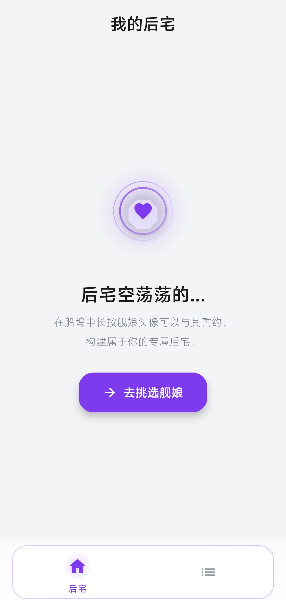
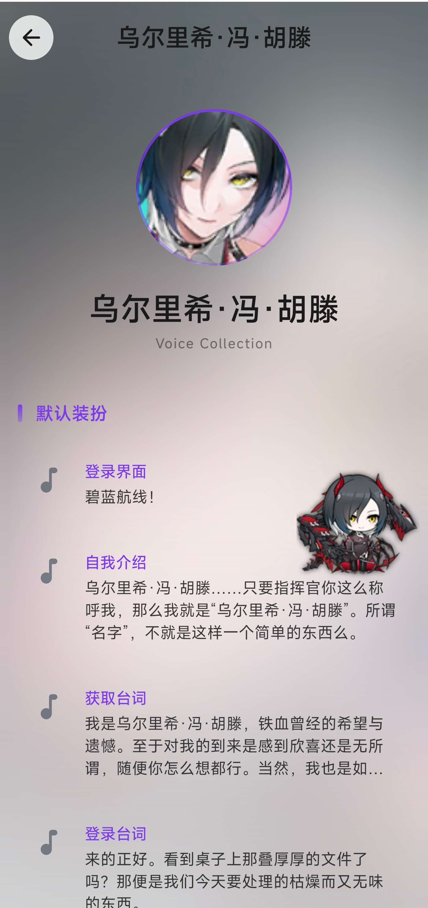

# 🚢 BLYY - 碧蓝航线语音播放器

<p align="center">
  
</p>

<p align="center">
  <strong>一款现代化的碧蓝航线舰娘语音播放器 Android 应用</strong>
</p>

<p align="center">
  <a href="#功能特性">功能特性</a> •
  <a href="#截图预览">截图预览</a> •
  <a href="#安装">安装</a> •
  <a href="#技术栈">技术栈</a> •
  <a href="#贡献指南">贡献指南</a>
</p>

<p align="center">
  
  
  
  
</p>

---

## 📖 项目简介

BLYY 是一款专为碧蓝航线玩家设计的语音播放器应用，提供优雅的界面和流畅的用户体验。用户可以浏览舰娘列表、收藏喜爱的角色、播放各种语音台词，并享受精美的视觉效果。

### ✨ 功能特性

- 🎨 **现代化 UI 设计**
  - Material Design 3 设计语言
  - 毛玻璃效果与动态背景
  - 深色/浅色主题支持
  - 流畅的动画效果

- 🚢 **舰娘管理**
  - 浏览完整的舰娘列表
  - 按阵营、类型、稀有度筛选
  - 收藏喜爱的舰娘到后宅
  - 卡片式布局展示

- 🎵 **语音播放**
  - 播放舰娘各种语音台词
  - 按皮肤分类浏览语音
  - 后台播放支持
  - 媒体会话控制

- 🎭 **立绘互动**
  - 可拖动的舰娘立绘小人
  - 点击立绘随机播放语音
  - 沉浸式语音播放界面

- 📱 **现代化架构**
  - MVVM 架构模式
  - Jetpack Compose 声明式 UI
  - Hilt 依赖注入
  - Kotlin Flow 响应式编程

## 📸 截图预览

| 船坞界面 | 后宅界面 | 语音播放界面 |
|:-------:|:-------:|:-----------:|
|  |  |  |

## 🔧 环境要求

- Android 8.0 (API 26) 或更高版本
- Android Studio Ladybug | 2024.2.1 或更高版本
- JDK 17 或更高版本
- Kotlin 1.9.0 或更高版本

## 📥 安装

### 从源码构建

1. **克隆仓库**
   ```bash
   git clone https://github.com/oneroomlife/blyy.git
   cd blyy
   ```

2. **打开项目**
   - 使用 Android Studio 打开项目目录
   - 等待 Gradle 同步完成

3. **构建运行**
   ```bash
   # Debug 版本
   ./gradlew assembleDebug
   
   # Release 版本
   ./gradlew assembleRelease
   ```

4. **安装到设备**
   ```bash
   adb install app/build/outputs/apk/debug/app-debug.apk
   ```

### 下载 APK

前往 [Releases](https://github.com/oneroomlife/blyy/releases) 页面下载最新版本的 APK 文件。

## 🏗️ 技术栈

### 核心技术

| 技术 | 用途 |
|-----|------|
| [Kotlin](https://kotlinlang.org/) | 主要开发语言 |
| [Jetpack Compose](https://developer.android.com/jetpack/compose) | 声明式 UI 框架 |
| [Material Design 3](https://m3.material.io/) | UI 设计系统 |
| [Hilt](https://dagger.dev/hilt/) | 依赖注入 |
| [Kotlin Flow](https://kotlinlang.org/docs/flow.html) | 响应式编程 |
| [Room](https://developer.android.com/training/data-storage/room) | 本地数据库 |
| [Media3 ExoPlayer](https://developer.android.com/media/media3) | 音频播放 |
| [Coil](https://coil-kt.github.io/coil/) | 图片加载 |
| [Jsoup](https://jsoup.org/) | HTML 解析 |

### 架构设计

```
├── data/                    # 数据层
│   ├── local/              # 本地数据源 (Room)
│   ├── model/              # 数据模型
│   └── repository/         # 数据仓库
├── di/                      # 依赖注入模块
├── domain/                  # 业务逻辑层 (Use Cases)
├── service/                 # 后台服务 (Media Playback)
├── ui/                      # 表现层
│   ├── components/         # 可复用组件
│   ├── screens/            # 界面屏幕
│   └── theme/              # 主题配置
└── viewmodel/               # 视图模型
```

## 🤝 贡献指南

我们欢迎所有形式的贡献！请阅读以下指南：

### 如何贡献

1. **Fork 项目**
   ```bash
   git clone https://github.com/oneroomlife/blyy.git
   ```

2. **创建功能分支**
   ```bash
   git checkout -b feature/amazing-feature
   ```

3. **提交更改**
   ```bash
   git commit -m 'feat: add amazing feature'
   ```

4. **推送到分支**
   ```bash
   git push origin feature/amazing-feature
   ```

5. **创建 Pull Request**

### 提交规范

我们使用 [Conventional Commits](https://www.conventionalcommits.org/) 规范：

- `feat:` 新功能
- `fix:` 修复 bug
- `docs:` 文档更新
- `style:` 代码格式调整
- `refactor:` 代码重构
- `test:` 测试相关
- `chore:` 构建/工具相关

### 代码规范

- 遵循 [Kotlin 编码规范](https://kotlinlang.org/docs/coding-conventions.html)
- 使用 ktlint 进行代码格式化
- 编写有意义的提交信息

## 📋 行为准则

请阅读并遵守我们的 [行为准则](CODE_OF_CONDUCT.md)，以确保为所有人提供友好、安全和受欢迎的环境。

## 📄 许可证

本项目采用 MIT 许可证 - 详见 [LICENSE](LICENSE) 文件。

## 🙏 致谢

- [碧蓝航线 Wiki](https://wiki.biligame.com/blhx/) - 数据来源
- [Material Design](https://material.io/) - 设计指南
- 所有贡献者和支持者

## 📮 联系方式

- 提交 Issue: [GitHub Issues](https://github.com/oneroomlife/blyy/issues)
- 功能建议: [GitHub Discussions](https://github.com/oneroomlife/blyy/discussions)

---

<p align="center">
  Made with ❤️ by BLYY Contributors
</p>
