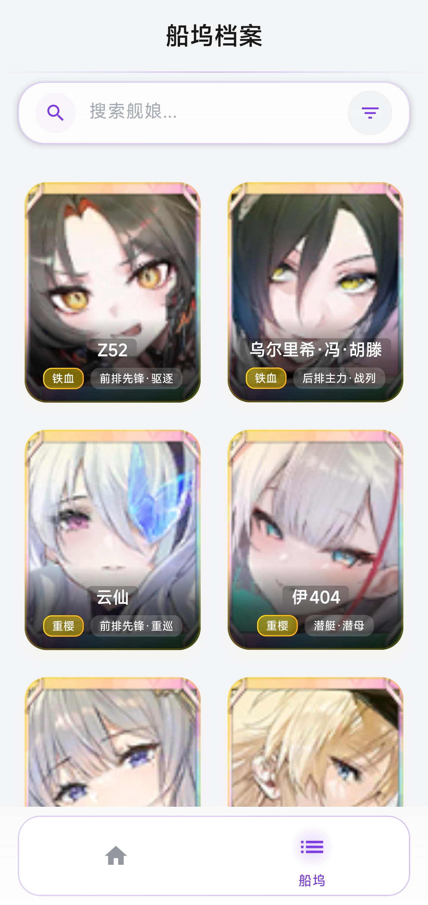
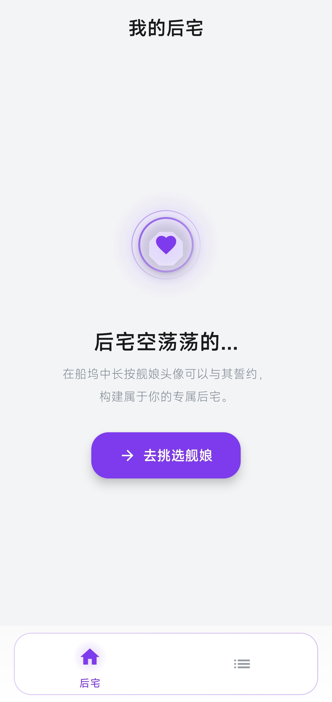
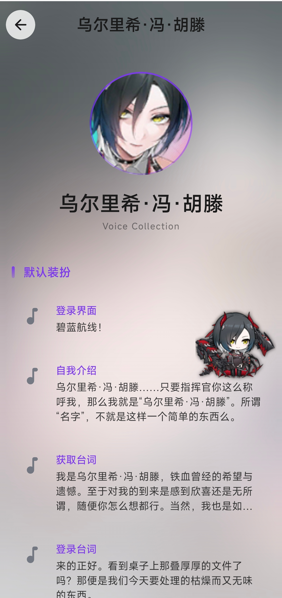

# 🚢 BLYY - 碧蓝航线语音播放器

<p align="center">
  
</p>

<p align="center">
  <strong>一款现代化的碧蓝航线舰娘语音播放器 Android 应用</strong>
</p>

<p align="center">
  <a href="#features">功能特性</a> •
  <a href="#screenshots">截图预览</a> •
  <a href="#usage">使用说明</a> •
  <a href="#install">安装</a> •
  <a href="#tech-stack">技术栈</a> •
  <a href="#project-structure">项目结构</a> •
  <a href="#avatar-matcher">头像匹配</a> •
  <a href="#testing">测试</a> •
  <a href="#ci">CI</a> •
  <a href="#contributing">贡献指南</a> •
  <a href="#acknowledgements">致谢</a>
</p>

<p align="center">
  
  
  
  
  
</p>

---

## 📖 项目简介

碧蓝语音（BLYY）是一款专为碧蓝航线玩家设计的多功能舰娘应用，基于 Kotlin 2.1 + Jetpack Compose 构建，涵盖**语音播放、舰娘图鉴、秘书舰桌面互动、AI 角色扮演对话、猜舰娘小游戏、水印相机**等能力。应用内置全量舰娘本地头像匹配引擎，支持双主题风格（经典紫色 / 指挥中心 HUD）与流畅的动画体验。

<a id="features"></a>

## ✨ 功能特性

### 🏠 底部导航三大主页

#### 后宅（Home）
- 誓约舰娘的后宅展示页，AGSL 着色器驱动的誓约粉色动态光效、稀有度光晕、收藏徽章
- 小屏/手表端自适应：检测屏幕最小宽度 ≤ 360dp 时自动缩放 UI

#### 船坞（Gallery）
- 完整舰娘图鉴，按阵营/舰种/稀有度多维筛选，支持搜索
- **双档案模式**：舰船档案（DOCK）/ 成员档案（STUDENT）动态切换
- **长按舰娘头像誓约/解除誓约**，誓约后立绘自动切换婚皮
- **本地头像匹配引擎**：内置 1000+ 高清头像资产，全量 wiki 图鉴 999/999 命中（详见[头像匹配系统](#avatar-matcher)）
- 骨架屏加载 + 卡片飞入动画

#### 关于（About）
- 版本信息、检查更新（对接网盘发布链接）
- 缓存管理、开源依赖清单

### 🎵 语音播放
- 全量舰娘语音台词，中/日双语切换
- 播放模式：单曲循环 / 列表循环 / 随机播放
- **稍后播放队列**：长按语音条目入队，支持队列管理与播放全部
- Media3 ExoPlayer + MediaSession：锁屏控制、耳机线控、前台服务

### 🎭 秘书舰模式
- 可拖动的舰娘小人悬浮窗（SYSTEM_ALERT_WINDOW），点击随机播放语音
- **随机秘书舰**：按稀有度权重从船坞抽取每日秘书舰
- Spine 骨骼动画渲染 SD 小人，支持誓约婚皮立绘

### 🐦 啾信（AI 角色扮演对话）
- 与 AI 舰娘进行沉浸式角色扮演对话，支持多轮上下文
- **舰娘人格管理**：为每名舰娘配置人设、开场白、表情包
- **舰娘长期记忆**：对话摘要自动沉淀，跨会话记忆舰娘性格
- 会话列表管理、啾信语音（对话内容驱动 TTS 语音回复）
- 在「设置 → 啾信配置」配置 API Key 与模型参数

### 🤖 碧蓝航线助手
- **查玩家**：指挥官信息（等级、UID、收集率、资源、委托、科研、待办副本）
- **查建造**：建造记录分页查询（最多 500 条）
- UID 与服务器在「设置 → 碧蓝航线助手」统一配置

### 🎮 猜舰娘小游戏
- **看图识舰娘**：根据立绘辨认舰娘
- **听音识舰娘**：根据语音辨认舰娘
- 答题得分、答题历史回顾、全服排行榜

### 🎨 更多功能
- **SD 资源图鉴**：浏览 Spine 骨骼动画 SD 小人资源，支持本地导入整理（zstd 压缩解析）
- **Live2D 皮肤库**：导入本地 Cubism 3/4 模型（文件夹/zip 免权限导入），内置 pixi-live2d-display 渲染，支持动作/表情/手势交互与真实缩略图
- **水印相机**：CameraX 拍照 + 可定制水印排版（相框/标题/署名），支持截图编辑
- **应用图标设置**：多种启动器图标风格任选

### 🌗 视觉与交互
- Material Design 3，深色/浅色主题自动适配
- **双主题**：经典风格 / 指挥中心（Command Center）HUD 风格
- 毛玻璃效果、切角矩形面板、AGSL 深度阴影系统（Depth 阴影令牌/受光渐变/按钮辉光投影）
- 8dp 网格间距系统、统一动画规范、切角形状（BlyyShapes）

<a id="screenshots"></a>

## 📸 截图预览

| 船坞界面 | 后宅界面 | 语音播放界面 |
|:-------:|:-------:|:-----------:|
|  |  |  |

> 注：截图位于 `docs/screenshots/` 目录；如截图与最新版本不一致，请提交 Issue 提醒更新。

## 🔧 环境要求

| 工具 | 版本要求 |
|------|---------|
| Android Studio | 最新稳定版（AGP 9.1.1 需较新版本支持） |
| JDK | 17（Gradle Toolchain 自动对齐） |
| Kotlin | 2.1.10（Compose Compiler 插件随版本启用） |
| Gradle | 9.6.1（项目自带 wrapper，无需手动安装） |
| Android SDK | minSdk 24 / targetSdk 35 / compileSdk 36 |
| 设备 | Android 7.0 (API 24) 或更高 |

<a id="install"></a>

## 📥 安装

### 从源码构建

1. **克隆仓库**
   ```bash
   git clone https://github.com/oneroomlife/blyy.git
   cd blyy
   ```

2. **打开项目**
   - 使用 Android Studio 打开项目根目录
   - 等待 Gradle 同步完成（首次会自动下载 libgdx natives）

3. **构建 APK**
   ```bash
   # Debug 版本
   ./gradlew :app:assembleDebug

   # Release 版本（需自行配置签名）
   ./gradlew :app:assembleRelease
   ```

4. **安装到设备**
   ```bash
   ./gradlew :app:installDebug
   # 或
   adb install app/build/outputs/apk/debug/app-debug.apk
   ```

### 下载已发布版本

前往 [Releases](https://github.com/oneroomlife/blyy/releases) 或应用内「关于 → 检查更新」下载最新 APK

<a id="usage"></a>

## 📖 使用说明

### 导航结构

- **底部三个主页面**：后宅 / 船坞（舰船⇆成员档案切换）/ 关于
- **侧拉菜单**：语音播放、秘书舰、啾信、碧蓝航线助手、猜舰娘、SD 资源图鉴、Live2D 皮肤、水印相机、设置

### 碧蓝航线助手

1. 从侧拉菜单进入 **碧蓝航线助手**，首次使用提示「未配置查询参数」，点击 **去设置**
2. 在「设置 → 碧蓝航线助手」填入默认 UID 与服务器
3. 返回助手页切换「查玩家」/「查建造」分区查询

### 啾信（AI 对话）

1. 从侧拉菜单进入 **啾信**，首次使用引导配置 API Key
2. 在「设置 → 啾信配置」填入 API Key 和模型参数；在「啾信舰娘配置」为舰娘创建人格
3. 返回啾信页面选择舰娘人设开始对话，对话会自动沉淀长期记忆

### 稍后播放队列

1. 语音列表页长按某条语音选择 **稍后播放** 入队
2. 播放控制栏的 **列表按钮** 打开队列弹窗，支持单项播放/播放全部/清空/移除

### 切换主题

在「设置 → 界面风格」开启/关闭 **指挥中心 UI**，即可在经典风格与 HUD 风格间切换。

### 秘书舰

1. 后宅长按舰娘卡片或从侧拉菜单进入 **秘书舰模式**
2. 授予悬浮窗权限后，舰娘小人常驻屏幕，点击随机播放语音
3. 「随机秘书舰」页面可开启每日按稀有度自动抽取

<a id="tech-stack"></a>

## 🏗️ 技术栈

| 技术 | 版本 | 用途 |
|------|------|------|
| [Kotlin](https://kotlinlang.org/) | 2.1.10 | 开发语言（KSP + Compose Compiler 插件） |
| [Jetpack Compose](https://developer.android.com/jetpack/compose) | BOM | 声明式 UI 框架 + Navigation Compose |
| [Material Design 3](https://m3.material.io/) | - | UI 设计系统 |
| [Hilt](https://dagger.dev/hilt/) | 2.59.2 | 依赖注入（KSP 编译） |
| [Room](https://developer.android.com/training/data-storage/room) | 2.8.4 | 本地数据库（舰娘/答题历史） |
| [DataStore Preferences](https://developer.android.com/topic/libraries/architecture/datastore) | 1.2.0 | 偏好与玩家设置存储 |
| [Media3 ExoPlayer](https://developer.android.com/media/media3) | 1.3.1 | 音频播放 + MediaSession |
| [Coil](https://coil-kt.github.io/coil/) | 2.7.0 | 图片加载（含 GIF） |
| [OkHttp](https://square.github.io/okhttp/) | 4.12.0 | 网络请求 |
| [kotlinx.serialization](https://github.com/Kotlin/kotlinx.serialization) | 1.10.0 | JSON 序列化 |
| [Jsoup](https://jsoup.org/) | 1.18.1 | wiki HTML 解析 |
| [Spine + libgdx](https://esotericsoftware.com/spine-runtimes) | 3.8.99.1 / 1.13.5 | SD 小人骨骼动画运行时 |
| [pixi.js + pixi-live2d-display](https://github.com/guansss/pixi-live2d-display) | 6.5.10 / 0.4.0 | Live2D 模型 Web 渲染运行时（内置 assets） |
| [CameraX](https://developer.android.com/media/camera/camerax) | 1.6.1 | 水印相机 |
| [pinyin4j](https://github.com/belerweb/pinyin4j) | 2.5.1 | 中文转拼音（头像/SD 资源匹配） |
| [compose-shimmer](https://github.com/valentinilk/compose-shimmer) | 1.3.3 | 骨架屏动画 |

完整依赖清单以 [`gradle/libs.versions.toml`](gradle/libs.versions.toml) 为准，架构设计详见 [docs/ARCHITECTURE.md](docs/ARCHITECTURE.md)。

<a id="project-structure"></a>

## 📁 项目结构

```
blyy/
├── app/                                # Android 应用模块
│   ├── build.gradle.kts                # 应用构建脚本（含 libgdx natives 提取任务）
│   ├── lint-baseline.xml               # Lint 基线
│   ├── proguard-rules.pro              # R8/ProGuard 规则
│   └── src/
│       ├── main/
│       │   ├── AndroidManifest.xml     # 应用清单
│       │   ├── assets/
│       │   │   ├── blhx_avatar/        # 舰娘本地头像资产（1100+，拼音命名）
│       │   │   ├── blhx_sd/            # 舰娘 SD 小人资源（Spine 骨骼）
│       │   │   └── photo_frame/        # 水印相机相框素材
│       │   ├── java/com/azurlane/blyy/
│       │   │   ├── MainActivity.kt     # 主入口
│       │   │   ├── SecretaryOverlayService.kt  # 秘书舰悬浮窗服务
│       │   │   ├── data/               # 数据层
│       │   │   │   ├── local/          # Room（AppDatabase/DAO）+ DataStore
│       │   │   │   ├── model/          # 数据模型
│       │   │   │   └── repository/     # 数据仓库（wiki 抓取/语音解析）
│       │   │   ├── di/                 # Hilt 依赖注入
│       │   │   ├── domain/             # 用例层（选秘书舰等 UseCase）
│       │   │   ├── service/            # Media3 PlaybackService
│       │   │   ├── ui/
│       │   │   │   ├── components/     # 公共 UI 组件（ShipCard 等）
│       │   │   │   ├── icons/          # 自定义图标
│       │   │   │   ├── screens/        # 26 个界面屏幕
│       │   │   │   └── theme/          # 主题与设计系统（Token/Depth 阴影）
│       │   │   ├── util/               # 工具层
│       │   │   │   ├── AvatarMatcher.kt        # 头像匹配核心（纯 Kotlin）
│       │   │   │   ├── LocalAvatarResolver.kt  # assets 头像解析壳
│       │   │   │   ├── SDResourceManager.kt    # SD 资源管理
│       │   │   │   ├── WebViewHtmlFetcher.kt   # wiki 抓取器
│       │   │   │   └── ...             # 更新检查/缓存/权限/水印合成等
│       │   │   └── viewmodel/          # ViewModel 层（20+）
│       │   └── res/                    # 资源（图片、字符串、主题）
│       └── test/                       # JVM 单元测试
│           └── util/AvatarMatcherTest.kt       # 头像匹配全量回归测试
│           └── resources/                      # wiki 全量舰名 + 资产快照
├── docs/                               # 项目文档
│   ├── ARCHITECTURE.md                 # 架构与 API 文档
│   ├── UI_TOKEN_GUIDE.md               # 设计 Token 速查表
│   ├── USAGE.md                        # 使用说明
│   └── screenshots/                    # 截图
├── .github/                            # GitHub 配置（Issue 模板 / CI 工作流）
├── gradle/
│   ├── libs.versions.toml              # 版本目录（依赖唯一事实来源）
│   └── wrapper/
├── scripts/                            # 本地工具脚本（不入版本控制）
├── .gitignore / .gitattributes
├── build.gradle.kts                    # 根 Gradle 脚本
├── gradle.properties                   # Gradle 属性
├── gradlew / gradlew.bat               # Gradle Wrapper
├── settings.gradle.kts                 # 项目设置
├── README.md                           # 项目说明（本文档）
├── CODE_OF_CONDUCT.md / CONTRIBUTING.md / LICENSE / SECURITY.md
```

<a id="avatar-matcher"></a>

## 🧩 头像匹配系统

应用内置离线优先的舰娘头像匹配引擎，是船坞/后宅/秘书舰等所有场景的立绘来源：

- **资产约定**：`assets/blhx_avatar/` 下以「舰名无声调全拼 + 皮肤后缀」命名（如 `boge.webp` ← 博格、`z23_h.webp` ← Z23 婚皮、`dafeng_alter.webp` ← 大凤·META）
- **十级匹配策略**：手动映射 → 特殊变体（META/μ兵装/幼女）→ 改造/尾部标记 → 原始名/拼音精确 → 去后缀变体 → 包含/反向包含/模糊子串兜底
- **皮肤形态硬规则**：META/μ兵装/改造立绘缺失时拒绝回退基础形态（避免错图），改走网络 URL 兜底
- **全量回归测试**：`AvatarMatcherTest` 用 wiki 图鉴 999 个舰名逐一校验，当前 **999/999 命中、零碰撞**；新增资源或舰娘后运行 `./gradlew :app:testDebugUnitTest --tests "*AvatarMatcherTest*"` 防回归

<a id="testing"></a>

## 🧪 测试

```bash
# 运行全部 JVM 单元测试
./gradlew :app:testDebugUnitTest

# 头像匹配全量回归（999 舰名逐一校验）
./gradlew :app:testDebugUnitTest --tests "com.azurlane.blyy.util.AvatarMatcherTest"
```

提交前建议运行 `./gradlew :app:lint`（项目带 lint-baseline.xml）。

<a id="ci"></a>

## ⚙️ CI

GitHub Actions（[android.yml](.github/workflows/android.yml)）在 push / PR 时自动以 JDK 17 构建并执行检查。

<a id="contributing"></a>

## 🤝 贡献指南

我们欢迎所有形式的贡献！请阅读 [CONTRIBUTING.md](CONTRIBUTING.md) 了解详细流程。

### 提交流程

1. **Fork 项目** 并克隆到本地
2. **创建特性分支**：`git checkout -b feature/amazing-feature`
3. **提交更改**：`git commit -m 'feat: add amazing feature'`
4. **推送到分支**：`git push origin feature/amazing-feature`
5. **创建 Pull Request**

### 提交规范

本项目使用 [Conventional Commits](https://www.conventionalcommits.org/) 规范：

| 前缀 | 用途 |
|------|------|
| `feat:` | 新增功能 |
| `fix:` | 修复 Bug |
| `docs:` | 文档更新 |
| `style:` | 代码格式调整（不影响逻辑） |
| `refactor:` | 代码重构（既不是新增功能，也不是修复 Bug） |
| `perf:` | 性能优化 |
| `test:` | 测试相关 |
| `chore:` | 构建 / 工具链相关 |
| `ci:` | CI/CD 配置 |

格式：`<type>(<scope>): <subject>`，例如 `feat(voice): add play later queue animation`

### 代码规范

- 遵循 [Kotlin 官方编码规范](https://kotlinlang.org/docs/coding-conventions.html)
- UI 代码严格遵守项目 [设计系统](app/src/main/java/com/azurlane/blyy/ui/theme/)
  - 颜色：`AppColors`
  - 间距：`AppSpacing`（8dp 网格）
  - 形状：`BlyyShapes`（切角矩形）
  - 动画：`AppAnimation`
  - 深度阴影：`AppDepth`（参考 [UI Token 速查表](docs/UI_TOKEN_GUIDE.md)）
- 新增头像资源请放入 `assets/blhx_avatar/` 并遵循拼音命名约定，跑一遍头像回归测试

## 📋 行为准则

请阅读并遵守 [CODE_OF_CONDUCT.md](CODE_OF_CONDUCT.md)，以确保为所有人提供友好、安全和受欢迎的环境。

## 🔒 安全策略

安全相关问题请参考 [SECURITY.md](SECURITY.md)，请勿在公开 Issue 中披露安全漏洞。

## 📄 许可证

本项目采用 **GNU General Public License v3.0** 许可证 — 详见 [LICENSE](LICENSE) 文件。

## ⚠️ 免责声明

**本项目中使用的所有游戏资源（包括但不限于台词、立绘、语音、图片等）的版权归原游戏公司所有。**

- 本项目为非官方粉丝作品，仅供学习和个人娱乐使用
- 所有游戏资源版权归 **碧蓝航线**（Azur Lane）及其运营公司所有
- 游戏数据来源于 [碧蓝航线 Wiki](https://wiki.biligame.com/blhx/)
- 如有侵权，请通过 [GitHub Issues](https://github.com/oneroomlife/blyy/issues) 联系删除

**本项目不提供任何游戏资源文件，所有资源均通过网络从公开渠道获取。**

<a id="acknowledgements"></a>

## 🙏 致谢

### 数据与资源来源
- 📚 [碧蓝航线 Wiki](https://wiki.biligame.com/blhx/) - 舰娘数据与立绘来源
- 🎞️ [pixi-live2d-display](https://github.com/guansss/pixi-live2d-display) & [Live2D Cubism SDK](https://www.live2d.com/) - Live2D 模型 Web 渲染运行时
- 🦴 [Spine Runtime](https://esotericsoftware.com/spine-runtimes) - SD 小人骨骼动画运行时
- 🎨 [Material Design](https://material.io/) - 设计语言与组件规范
- 🛠️ [Jetpack Compose](https://developer.android.com/jetpack/compose) - 现代化的 Android UI 工具包

### 灵感与社区
- 感谢所有为本项目提交 Issue、PR、Star 的贡献者
- 感谢碧蓝航线玩家社区的反馈与建议

## 📮 联系方式

- 🐛 Bug 反馈：[GitHub Issues](https://github.com/oneroomlife/blyy/issues)
- 💡 功能建议：[GitHub Discussions](https://github.com/oneroomlife/blyy/discussions)
- 👤 维护者：[oneroomlife](https://github.com/oneroomlife)

---

<p align="center">
  Made with ❤️ by BLYY Contributors<br>
  <sub>本项目为非官方粉丝作品，与上海蛮啾网络 / 哔哩哔哩游戏无关</sub>
</p>
